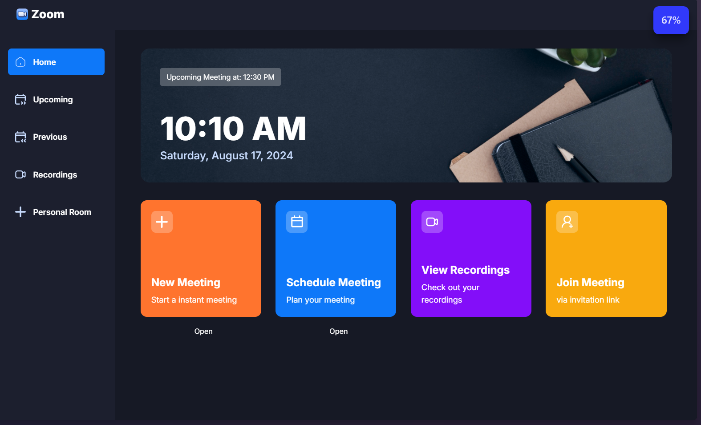
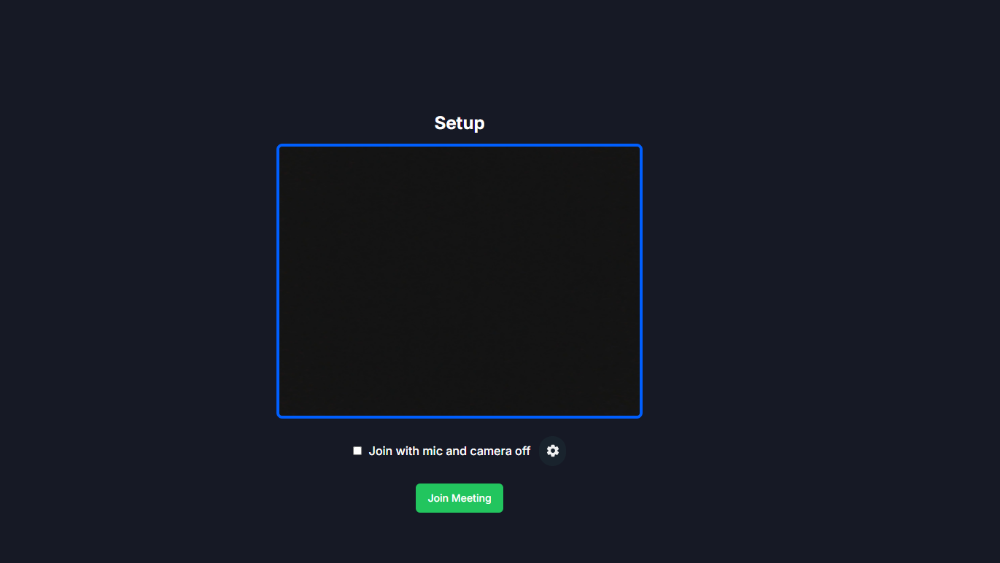
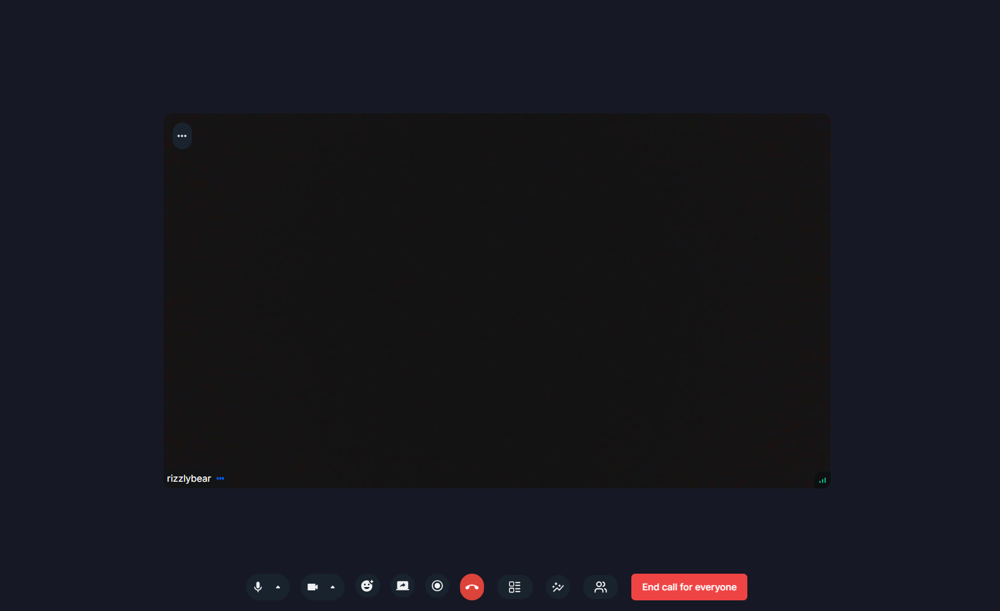

This is a [Next.js](https://nextjs.org/) project. Made using a brilliant tutorial for the purposes of learning next.js on top of my react knowledge.

## Getting Started

First, clone the repo and run `npm install` and then run the development server using any one of these scripts:

```bash
npm run dev
# or
yarn dev
# or
pnpm dev
# or
bun dev
```

Open [http://localhost:3000](http://localhost:3000) with your browser to see the result.

## Results
___



